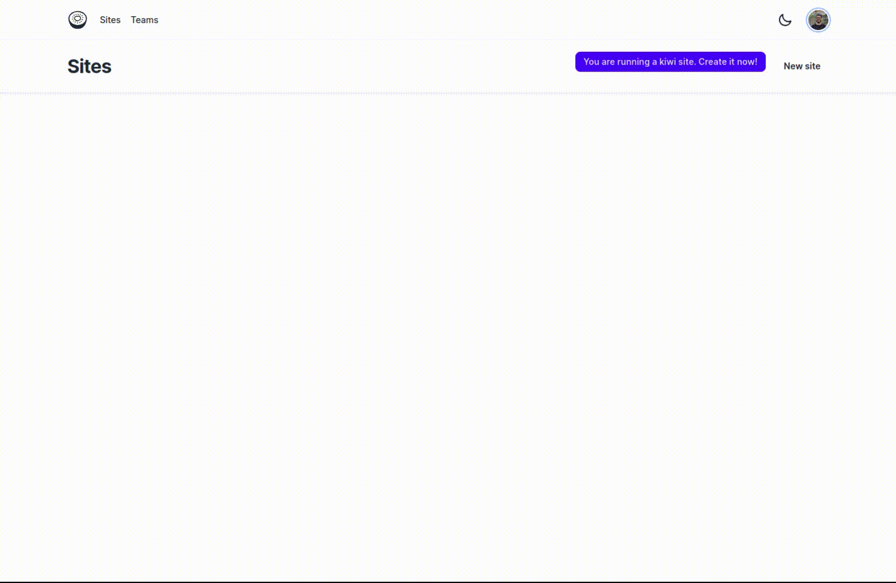

#  Kiwi template

This is a [Kiwi](https://kiwi-admin.vercel.app/) template.

## Installation and initialization

First, install the [Kiwi NextJS](https://www.npmjs.com/package/@kiwi-app/kiwi-nextjs) dependency

```bash
yarn add @kiwi-app/kiwi-nextjs
# or
npm i @kiwi-app/kiwi-nextjs
```

After that, initialize using the CLI

```bash
npx kiwi init
```

Nice! Now you can see your "kiwi" folders inside "app" grouped on "(kiwi)", right?

If you're using tailwind, add this content at your config file:

```javascript
{
  content: [
    // ...your contents,
    "./src/app/(kiwi)/**/*.tsx"
  ],
  // ...tailwind config
}
```

## Configuration

You need to configure two env vars which will be used by 'kiwi-nextjs' for intergrate with the admin.

- NEXT_PUBLIC_KIWI_ADMIN_URL: https://kiwi-admin.vercel.app (or you can use your own kiwi admin url, soon 👀)
- NEXT_PUBLIC_KIWI_API_KEY

### Kiwi API Key

Make sure you've already configured the **NEXT_PUBLIC_KIWI_ADMIN_URL**.

To get your **kiwi api key**, you should start your project (**at port 3000**, by default) and open the [admin](https://kiwi-admin.vercel.app).

#### Step by step for api key creation
